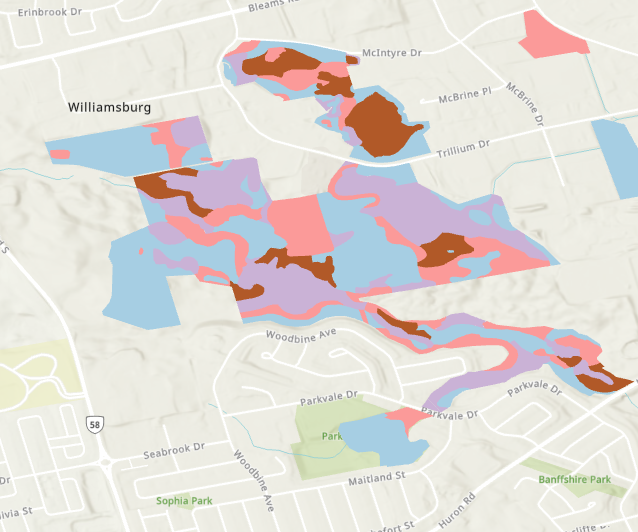
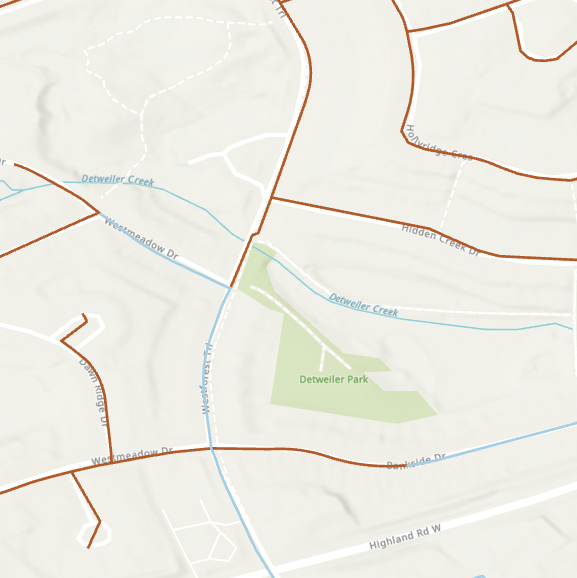

# ArcGIS Pro Greedy Colorization

Toolbox applies the greedy color algorithm to point or polygon features. Goal is to symbolize the features with the fewest required colors.

This is best used in scenarios where there are a large number of features and the colors are not important.

## Installation Requirements

Requirements

* ArcGIS Pro (Locally installed)
* networkx [https://networkx.org/](https://networkx.org/)

To run, the networkx library must be installed in a cloned arcgis pro environment. 

Clone the environment in your Python settings in ArcGIS Pro, or via the commandline and set this as the active python environment.

once cloned, install the networkx library.

    pip install networkx

## Usage

When run in ArcGIS Pro, the tool will use the open map and active view. Based on the selected layer and field, the dataset will be colored with the fewest colors required to avoid color collisions.

## Method

To calculate the minimum number of features, the toolbox must generate a graph representation of the dataset. As the graph represents a connected network, with nodes and links, the dataset is converted to this representation based on its spatial location.

For polyline feature, the expectation is that each end represents a connected location. For example, two lines that end on each other, are considered connected and will be linked together. This represented is with the lines as node element in a graph, linked with an arbitrary line. 

To calculate the graph the polyline feature is reduced to a point feature class with a point representing each end of the line. Each line will contain two points, sharing the input field value, which will then create the link in the networkx graph.

A spatial join is completed to find the connected locations. The polygon features skips the previous step, and begins here. Similar assumption, in this case, if it touches, it is connected.

Finally, the greedy color algorithm is applied to the graph and the layer is updated via the CIM in ArcGIS Pro.

## Examples

### Polygon Layer

### Polyline Layer

